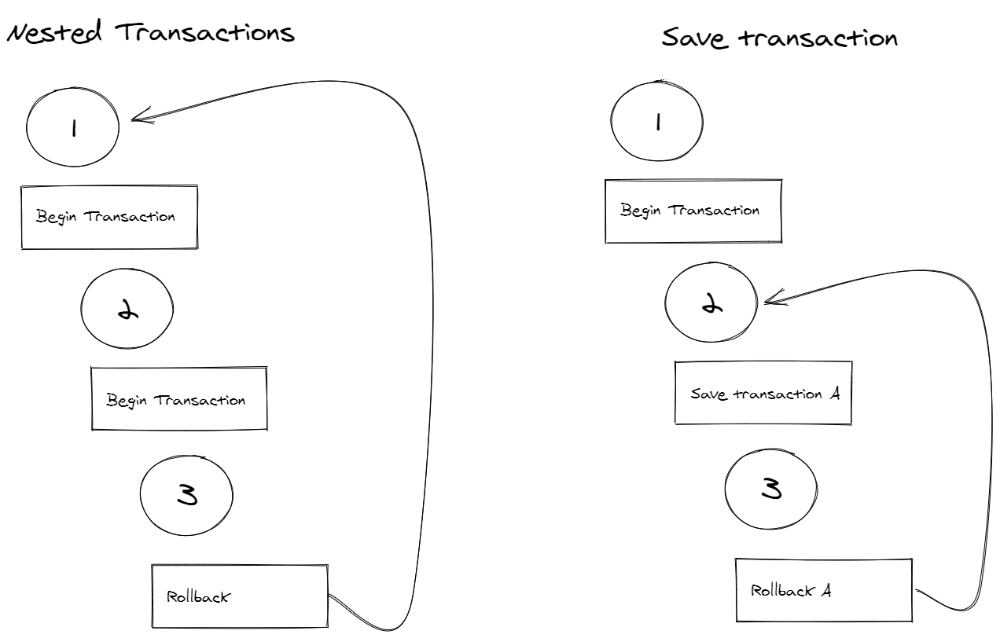

# Como funciona a transação do SaveChanges no EF Core

O método `SaveChanges` é responsável por salvar todas as alterações no banco de dados quando se está trabalhando com o Entity Framework Core. Ao executar esse método, por padrão, estamos executando as operações dentro de uma transação. A [documentação](https://docs.microsoft.com/pt-br/ef/core/saving/transactions) diz:

> Por padrão, se o provedor de banco de dados oferecer suporte a transações, todas as alterações em uma única chamada para SaveChanges serão aplicadas em uma transação. Se qualquer uma das alterações falhar, a transação é revertida e nenhuma das alterações será aplicada ao banco de dados.

Será tratado aqui o funcionamento do método `SaveChanges` analisando os logs do EF Core e as consultas geradas. O foco da análise será o controle da transação. A versão da biblioteca nos testes é a 5 e o banco de dados utilizado na análise é o SQL Server da Microsoft. Os resultados encontrados podem ser diferentes em outras versões e/ou utilizando outro bancos de dados.

## Configurando o `DbContext`

O contexto do banco de dados deve ser configurado para obter as informações necessárias para o entendimento do EF Core.

```csharp
protected override void OnConfiguring(DbContextOptionsBuilder optionsBuilder)
{
    optionsBuilder
        .UseSqlServer(
            "Data Source=localhost,1433;Initial Catalog=Timesheet;User Id=sa;Password=Password1")
        .LogTo(message => Debug.WriteLine(message));
}
```

O método `LogTo`, usado na configuração, é a nova maneira de acessar os logs do EF Core. A funcionalidade [Simple Logging](https://docs.microsoft.com/en-us/ef/core/logging-events-diagnostics/simple-logging) foi apresentada na versão 5 do ORM e permite direcionar as entradas de log para o tipo de saída desejada. No exemplo, os dados são direcionados para janela de Debug do Visual Studio usando o método `Debug.Writeline`. Nas versões antigas é possível se obter os logs usando o método `UseLoggerFactory`.

## Adicionando dados com o `SaveChanges`

Para verificar o funcionamento do `SaveChanges` foi escrito um teste simples adicionando dois objetos no banco de dados. No banco serão armazenadas duas linhas, uma em cada tabela.

``` csharp
var employee = new Employee
{
    Name = "John Doe",
    Entries = new List<TimeEntry>
    {
        new TimeEntry
        {
            Start = TimeSpan.FromHours(8),
            End = TimeSpan.FromHours(12)
        }
    }
};
context.Add(employee);

context.SaveChanges();
```

É possível ver no log gerado que os primeiros passos do EF Core na execução do método `SaveChanges` é a verificação das mudanças das entidades do contexto. Logo em seguida, a conexão com o banco é aberta.

``` sql
dbug: CoreEventId.SaveChangesStarting[10004] (Microsoft.EntityFrameworkCore.Update) 
      SaveChanges starting for 'TestContext'.
dbug: CoreEventId.DetectChangesStarting[10800] (Microsoft.EntityFrameworkCore.ChangeTracking) 
      DetectChanges starting for 'TestContext'.
dbug: CoreEventId.DetectChangesCompleted[10801] (Microsoft.EntityFrameworkCore.ChangeTracking) 
      DetectChanges completed for 'TestContext'.
dbug: RelationalEventId.ConnectionOpening[20000] (Microsoft.EntityFrameworkCore.Database.Connection) 
      Opening connection to database 'Timesheet' on server 'localhost,1433'.
dbug: RelationalEventId.ConnectionOpened[20001] (Microsoft.EntityFrameworkCore.Database.Connection) 
      Opened connection to database 'Timesheet' on server 'localhost,1433'.
```
As entradas de log seguintes são relacionadas à transação. No primeiro momento, a transação é iniciada com o level de isolamento não especificado. A próxima mensagem mostra que a transação foi inicializada com o level [`ReadCommitted`](https://docs.microsoft.com/pt-br/sql/relational-databases/sql-server-transaction-locking-and-row-versioning-guide?view=sql-server-ver15#database-engine-isolation-levels), que é o padrão do SQL Server.

``` sql
dbug: RelationalEventId.TransactionStarting[20209] (Microsoft.EntityFrameworkCore.Database.Transaction) 
      Beginning transaction with isolation level 'Unspecified'.
dbug: RelationalEventId.TransactionStarted[20200] (Microsoft.EntityFrameworkCore.Database.Transaction) 
      Began transaction with isolation level 'ReadCommitted'.
```
Em seguida são executados dois comandos `INSERT`, um para cada entidade. Como o `Id` das entidades são gerados pelo banco de dados, pode-se ver que, para cada `INSERT`, também foi realizado um `SELECT` para que o EF Core obtenha o Id da entidade inserida. Alguns logs de criação dos comandos e detecção de alterações de chave estrangeira foram omitidos.

```sql
dbug: RelationalEventId.CommandExecuting[20100] (Microsoft.EntityFrameworkCore.Database.Command) 
      Executing DbCommand [Parameters=[@p0='John Doe' (Size = 4000)], CommandType='Text', CommandTimeout='30']
      SET NOCOUNT ON;
      INSERT INTO [Employees] ([Name])
      VALUES (@p0);
      SELECT [Id]
      FROM [Employees]
      WHERE @@ROWCOUNT = 1 AND [Id] = scope_identity();

dbug: RelationalEventId.CommandExecuting[20100] (Microsoft.EntityFrameworkCore.Database.Command) 
      Executing DbCommand [Parameters=[@p1='3' (Nullable = true), @p2='12:00:00', @p3='08:00:00'], CommandType='Text', CommandTimeout='30']
      SET NOCOUNT ON;
      INSERT INTO [TimeEntries] ([EmployeeId], [End], [Start])
      VALUES (@p1, @p2, @p3);
      SELECT [Id]
      FROM [TimeEntries]
      WHERE @@ROWCOUNT = 1 AND [Id] = scope_identity();
```

Por último, é feito o `commit` da transação.

``` sql
dbug: RelationalEventId.TransactionCommitting[20210] (Microsoft.EntityFrameworkCore.Database.Transaction) 
      Committing transaction.
dbug: RelationalEventId.TransactionCommitted[20202] (Microsoft.EntityFrameworkCore.Database.Transaction) 
      Committed transaction.
```

## Controlando a transação

Para a maioria dos casos, o uso do `SaveChanges` é o suficiente para garantir a consistência dos dados. Porém, quando preciso, é possível controlar as transações manualmente.

O teste seguinte utiliza o mesmo exemplo do primeiro. Dessa vez o método `SaveChanges` está sendo executado dentro de uma transaçao iniciada com  método `BeginTransaction`.

```csharp
var employee = new Employee
{
      Name = "John Doe",
      Entries = new List<TimeEntry>
      {
            new TimeEntry
            {
                  Start = TimeSpan.FromHours(8),
                  End = TimeSpan.FromHours(12)
            }
      }
};
context.Add(employee);

using var transaction = context.Database.BeginTransaction();

context.SaveChanges();

transaction.Commit();
```

As primeiras entradas do log são de abertura de transação. Como o primeiro teste, a transação é iniciada com o nível de isolamento não especificado e criada com o nível [`ReadCommited`](https://docs.microsoft.com/en-us/sql/relational-databases/sql-server-transaction-locking-and-row-versioning-guide?view=sql-server-ver15#database-engine-isolation-levels).

```sql
dbug: RelationalEventId.TransactionStarting[20209] (Microsoft.EntityFrameworkCore.Database.Transaction) 
      Beginning transaction with isolation level 'Unspecified'.
dbug: RelationalEventId.TransactionStarted[20200] (Microsoft.EntityFrameworkCore.Database.Transaction) 
      Began transaction with isolation level 'ReadCommitted'.
```
Ao executar o método `SaveChanges`, o EF Core cria um **savepoint** do banco de dados ao invés de abrir uma transação aninhada. Os logs de detecção de alterações nas entidades foram omitidos.
```sql
dbug: CoreEventId.SaveChangesStarting[10004] (Microsoft.EntityFrameworkCore.Update) 
      SaveChanges starting for 'TestContext'.

dbug: RelationalEventId.CreatingTransactionSavepoint[20212] (Microsoft.EntityFrameworkCore.Database.Transaction) 
      Creating transaction savepoint.
dbug: RelationalEventId.CreatedTransactionSavepoint[20213] (Microsoft.EntityFrameworkCore.Database.Transaction) 
      Created transaction savepoint.
```

Em seguida se realiza a execução dos comandos da mesma forma do primero teste.

```sql
dbug: RelationalEventId.CommandExecuting[20100] (Microsoft.EntityFrameworkCore.Database.Command) 
      Executing DbCommand [Parameters=[@p0='John Doe' (Size = 4000)], CommandType='Text', CommandTimeout='30']
      SET NOCOUNT ON;
      INSERT INTO [Employees] ([Name])
      VALUES (@p0);
      SELECT [Id]
      FROM [Employees]
      WHERE @@ROWCOUNT = 1 AND [Id] = scope_identity();

dbug: RelationalEventId.CommandExecuting[20100] (Microsoft.EntityFrameworkCore.Database.Command) 
      Executing DbCommand [Parameters=[@p1='5' (Nullable = true), @p2='12:00:00', @p3='08:00:00'], CommandType='Text', CommandTimeout='30']
      SET NOCOUNT ON;
      INSERT INTO [TimeEntries] ([EmployeeId], [End], [Start])
      VALUES (@p1, @p2, @p3);
      SELECT [Id]
      FROM [TimeEntries]
      WHERE @@ROWCOUNT = 1 AND [Id] = scope_identity();
```

Por fim, ao executadar o método `transaction.Commit()`, as alterações são confirmadas.

```sql
dbug: RelationalEventId.TransactionCommitting[20210] (Microsoft.EntityFrameworkCore.Database.Transaction) 
      Committing transaction.
dbug: RelationalEventId.TransactionCommitted[20202] (Microsoft.EntityFrameworkCore.Database.Transaction) 
      Committed transaction.
```

## Diferença entre transações aninhadas e savepoints no SQL Server

No SQL Server, o uso de transalçoes aninhadas tem um comportamento que costuma confundir os desenvolvedores. O `ROLLBACK` reverte todas as transações abertas da sessão. Não importa se existam transações aninhadas, o `ROLLBACK` vai desfazer todas as operações realizadas desde o primeiro `BEGIN TRANSACTION`.

Já o `SAVE TRANSACTION` coloca uma tag no ponto desejado da transação de forma a ser possível executar o `ROLLBACK` e reverter as mudanças até esse ponto. É possível criar vários savepoints em uma mesma transação. É importante lembrar que o `SAVE TRANSACTION` não abre uma transação.



## Savepoints no EF Core

O EF Core também permite a criação manual de savepoints usando o método `CreateSavepoint`.

```csharp
using var transaction = context.Database.BeginTransaction();

context.Add(new Employee { Name = "John Doe" });
context.SaveChanges();

transaction.CreateSavepoint("A");

context.Add(new Employee { Name = "Jane Doe" });
context.SaveChanges();

transaction.Commit();
```

## Versões anteriores

A funcionalidade de savepoints foi incluída no EF Core 5. Nas versões 3.1 e 2.1 o EF Core, além de não permitir a criação de savepoints de forma manual, também não executa um `SAVE TRANSACTION` durante a execução do método `SaveChanges`. No caso de não existir uma transação aberta no contexto o `SaveChanges` criará uma. Caso já exista, como no segundo teste, o `SaveChanges` apenas executa os comandos de alteração da base de dados.

## Conclusão

O método `SaveChanges` facilita a vida do desenvolvedor ao executar os comandos de alteração no banco de dados dentro de uma transação. Para os outros casos, em que se faz a abertura de uma transação manualmente, o `SaveChanges` apenas cria um savepoint dentro da transação.

## Referências

1. Simple Logging - https://docs.microsoft.com/pt-br/ef/core/logging-events-diagnostics/simple-logging
1. Usando transações - https://docs.microsoft.com/pt-br/ef/core/saving/transactions
1. Guia de Controle de Versão de Linha e Bloqueio de Transações - https://docs.microsoft.com/pt-br/sql/relational-databases/sql-server-transaction-locking-and-row-versioning-guide?view=sql-server-ver15
1. Nesting transactions and SAVE TRANSACTION command - https://dba-presents.com/index.php/databases/sql-server/43-nesting-transactions-and-save-transaction-command
1. SAVE TRANSACTION - https://docs.microsoft.com/pt-br/sql/t-sql/language-elements/save-transaction-transact-sql?view=sql-server-ver15
1. https://github.com/dotnet/efcore/blob/release/5.0/src/EFCore.Relational/Update/Internal/BatchExecutor.cs#L89
1. https://github.com/dotnet/efcore/blob/release/2.1/src/EFCore.Relational/Update/Internal/BatchExecutor.cs#L70